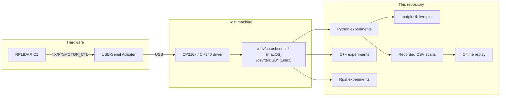

# LiDAR from Scratch

A hands-on, multi-language learning playground for the **SLAMTEC RPLIDAR C1**
2D LiDAR sensor. Each program in this repository is a small, standalone lesson
that explores one specific concept: detecting the sensor, reading raw scans,
converting polar coordinates to cartesian, drawing a live 2D map, detecting
obstacles, recording and replaying scans, and so on.

This is **not** a production library. It is a curated set of experiments that
build understanding, written so each file can be read end-to-end as a lesson.

---

## Quick links

- [`CLAUDE.md`](./CLAUDE.md) - Working principles and the experiment catalog.
- [`docs/hardware-setup.md`](./docs/hardware-setup.md) - Wiring, drivers, OS notes.
- [`docs/architecture.md`](./docs/architecture.md) - Repo layout and data flow.
- [`docs/protocol-notes.md`](./docs/protocol-notes.md) - Notes on the RPLIDAR
  serial protocol, learned by reading the official datasheet.
- [`docs/glossary.md`](./docs/glossary.md) - Domain vocabulary (ToF, scan,
  frame, point cloud, etc.).
- [`python/`](./python/README.md) - Python track, start here.
- [`cpp/`](./cpp/README.md) - C++ track, runs against the official SDK.
- [`rust/`](./rust/README.md) - Optional Rust track.
- [`house_mapper/`](./house_mapper/README.md) - Walk-and-scan 2D mapping
  subproject. Builds an occupancy grid as you carry the LiDAR around the
  house, with three switchable views (map, live scan, distance dashboard).

---

## Hardware

| Property       | Value                                                  |
| -------------- | ------------------------------------------------------ |
| Model          | SLAMTEC RPLIDAR C1                                     |
| Principle      | DToF (Direct Time of Flight)                           |
| Range          | 0.05 m to 12 m                                         |
| FoV            | 360 degrees                                            |
| Rotation rate  | 10 Hz (nominal)                                        |
| Sample rate    | 5 kHz                                                  |
| Connection     | USB, via included adapter board (CP210x or CH340)      |
| Baud rate      | 460800 (default)                                       |

On macOS the sensor appears as `/dev/cu.usbserial-*` or
`/dev/cu.SLAB_USBtoUART`. On Linux it appears as `/dev/ttyUSB*`.

---

## What this repo contains



Three independent language tracks. The unifying layer is the documentation,
not the build system.

---

## Quickstart on macOS (Apple Silicon)

1. Plug the LiDAR into a USB port and confirm it spins up after a moment.
2. **Allow the accessory to connect.** On Apple Silicon Macs running
   macOS Ventura or newer, new USB devices are gated behind a system
   setting. Open **System Settings -> Privacy & Security ->
   "Allow accessories to connect"** and either accept the prompt when
   it appears or set the policy to "Always" temporarily. See
   [`docs/hardware-setup.md`](./docs/hardware-setup.md) for the full
   explanation. Skip this step on Intel Macs.
3. Install the host dependencies:

   ```bash
   ./scripts/install_macos_deps.sh
   ```

4. Confirm the OS sees the sensor:

   ```bash
   ./scripts/detect_lidar_port.sh
   ```

5. Run the first Python experiment:

   ```bash
   cd python
   python3.11 -m venv .venv && source .venv/bin/activate
   pip install -r requirements.txt
   python experiments/01_hello_lidar.py
   ```

   The expected output prints the auto-detected port, the sensor model and
   firmware, then exits cleanly.

5. Walk forward through `experiments/02_*.py` and onward. Each file documents
   what it teaches and what success looks like at the top.

If anything fails at this stage, treat it as a hardware diagnosis problem
first (port name, cable, motor not spinning) and a code problem second. See
[`docs/hardware-setup.md`](./docs/hardware-setup.md).

---

## Quickstart on Linux (Ubuntu 24.04)

Linux does not gate USB devices behind a permission prompt, but it does
require your user account to be in the `dialout` group before you can
open `/dev/ttyUSB*`. The install script reminds you; do it once and log
out and back in.

```bash
./scripts/install_linux_deps.sh
sudo usermod -aG dialout "$USER"   # log out and back in for this to take effect
./scripts/detect_lidar_port.sh
cd python && python3 -m venv .venv && source .venv/bin/activate
pip install -r requirements.txt
python experiments/01_hello_lidar.py
```

See [`docs/hardware-setup.md`](./docs/hardware-setup.md) for distro
quirks (Arch uses `uucp` instead of `dialout`, ModemManager may grab
the port, SELinux may block sandboxed shells).

## Quickstart on Windows (10 and 11)

Windows does not require group membership but it does require the
correct USB-serial driver to be installed before the LiDAR appears as
a `COMx` port:

- **CP210x** adapters: install the driver from silabs.com.
- **CH340 / CH341** adapters: install the driver from wch-ic.com.

After installing, find the assigned port under Device Manager -> Ports
(COM & LPT) and pass it explicitly: `python experiments/01_hello_lidar.py
--port COM3`.

---

## Conventions

- No emojis anywhere. Code, comments, docs, commits, READMEs.
- English only, across all identifiers and prose.
- Each experiment is standalone. Duplication between experiments is a
  feature, not a bug, because each file should be readable on its own.
- Hardware errors get actionable messages. "Port not found" tells you how to
  list ports.
- Motor is always stopped on exit, including on exceptions and Ctrl+C.

See [`CLAUDE.md`](./CLAUDE.md) for the full working principles.

---

## License

MIT. See [`LICENSE`](./LICENSE).
