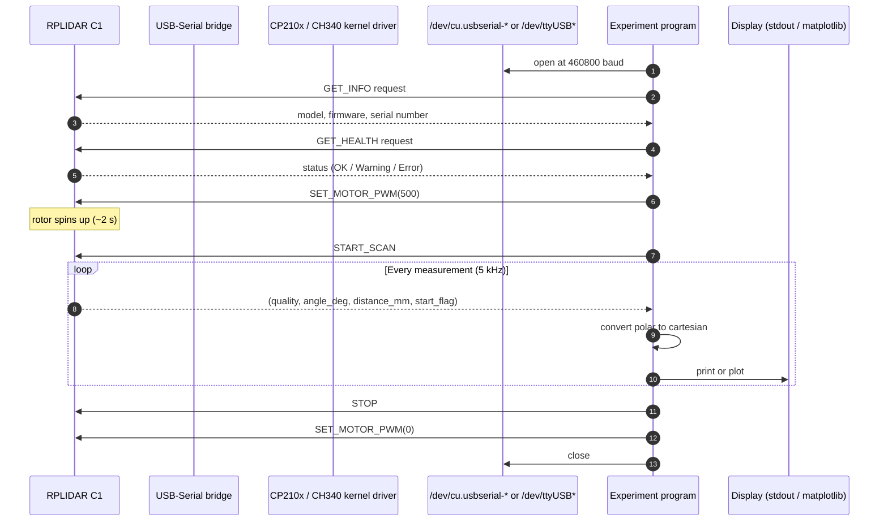
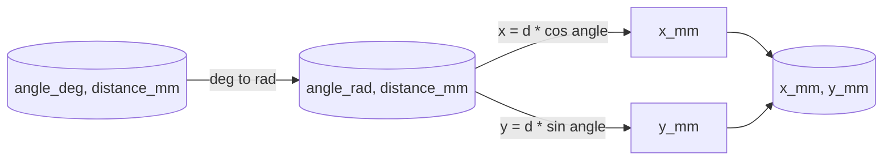
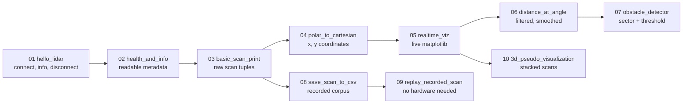

# Architecture

This document describes how the repository is organized and how data flows
from the sensor to your screen. The structure is deliberately simple and
flat: each experiment is a small, standalone program, and the directories
group experiments by programming language, not by feature.

## Why three language tracks

The same physical experiment runs on the same hardware. Implementing it in
Python, C++, and Rust teaches three things at once:

- **Python** teaches the concept fastest. You iterate in seconds and see the
  result in matplotlib.
- **C++** teaches what the official `rplidar_sdk` actually does. It is also
  the realistic path to ROS 2 nodes and embedded targets later.
- **Rust** teaches modern systems programming on real hardware: ownership
  of a serial port, async I/O, error handling without exceptions.

The unifying layer is the documentation. No shared build system, no shared
package manager, no shared abstractions across languages.

## Top-level layout

```mermaid
flowchart TD
    ROOT[lidar-from-scratch/]
    ROOT --> DOCS[docs/]
    ROOT --> PY[python/]
    ROOT --> CPP[cpp/]
    ROOT --> RS[rust/]
    ROOT --> DATA[data/]
    ROOT --> SCRIPTS[scripts/]
    ROOT --> CLAUDE[CLAUDE.md]
    ROOT --> README[README.md]

    DOCS --> D1[hardware-setup.md]
    DOCS --> D2[protocol-notes.md]
    DOCS --> D3[glossary.md]
    DOCS --> D4[architecture.md]

    PY --> PEXP[experiments/]
    PY --> PLIB[lib/ - only if duplication appears]
    PY --> PREQ[requirements.txt]

    CPP --> CEXP[experiments/]
    CPP --> CSDK[third_party/rplidar_sdk - git submodule]
    CPP --> CMAKE[CMakeLists.txt]

    RS --> REXP[experiments/]
    RS --> RTOML[Cargo.toml workspace]

    DATA --> SAMPLES[sample_*.csv]
    SCRIPTS --> SH1[detect_lidar_port.sh]
    SCRIPTS --> SH2[install_macos_deps.sh]
    SCRIPTS --> SH3[install_linux_deps.sh]
```

## Data flow: from sensor to pixel

The sensor pushes samples as fast as it can produce them. The host's job is
to read them off the serial port without dropping bytes, group them into
full revolutions, and decide what to do with each revolution.

## The coordinate frame

A 2D LiDAR returns each point as a polar pair: an angle and a distance. We
convert to cartesian (x, y) so we can draw the room.

The convention used in this repo for the sensor's body frame:

- The sensor sits at the origin (0, 0).
- 0 degrees points along the +X axis (the cable-out side of the unit, by
  default in `pyrplidar`).
- Angles increase counter-clockwise when viewed from above.
- Distances are in millimetres.

Different SDKs and ROS conventions disagree on the zero angle. The
`docs/glossary.md` and the relevant experiments call this out explicitly.

## The experiment progression

Each experiment builds on a concept introduced earlier, but each program is
self-contained. You should be able to read any single file end-to-end without
having read the others.

## Adding a new experiment

The shape is fixed. See the "Common Tasks" section in `CLAUDE.md` for the
exact procedure. The short version:

1. Pick the next number: `python/experiments/NN_descriptive_name.py`.
2. Write the standard header at the top: purpose, run command, expected
   output, common failure modes.
3. Implement with `argparse`. Auto-detect the port; allow `--port` override.
4. Wrap the lifecycle in `try/finally` so the motor always stops.
5. Add a one-line entry under "Experiments" in `python/README.md`.

## What lives outside this repo

The following are intentionally out of scope and belong in separate
repositories when their time comes:

- ROS 2 integration (`rplidar_ros2` node, launch files, RViz config).
- SLAM (`slam_toolbox`, `cartographer`).
- Navigation (`Nav2`, `Open-RMF`).
- Web dashboards, mobile clients, cloud sync.
- Production drivers or polished libraries.

Keeping those out of this repo is what allows each file in here to stay
readable as a lesson.
