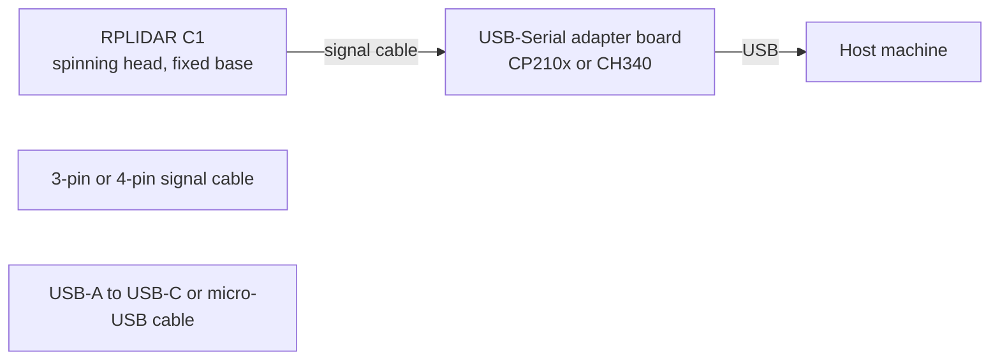
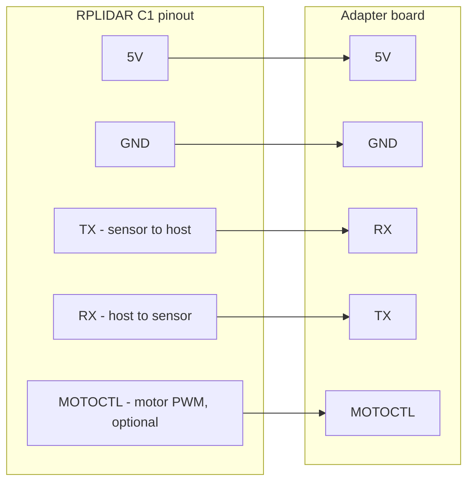

# Hardware setup

This page covers wiring, drivers, and OS-specific quirks for the SLAMTEC
RPLIDAR C1. The goal is to get a port name that an experiment can open, and
to know what "working hardware" looks and sounds like.

## What you have in the box



The adapter board is the part that matters from the host's point of view.
It contains a USB-to-UART bridge chip (Silicon Labs CP210x or WCH CH340)
that exposes a virtual serial port. The host talks to the bridge over USB;
the bridge talks to the sensor over UART at 460800 baud.

## What "working hardware" looks and sounds like

- Plug in the USB cable.
- After ~1 second, you should hear the rotor spin up briefly, then idle.
  Some firmware revisions keep the motor off until told to start; the
  experiments in this repo always issue `SET_MOTOR_PWM(500)` before
  scanning.
- The status LED on the adapter board lights up. If it does not, the cable
  may be data-less (charge-only) or the port is dead.

## macOS

The CP210x driver typically loads automatically on recent macOS releases.
If your unit ships with a CH340 adapter, you may need to install the
[WCH CH34x driver](https://www.wch-ic.com/downloads/CH34XSER_MAC_ZIP.html).
The first time you plug it in, macOS may show a "system extension blocked"
prompt; allow it in System Settings - Privacy & Security.

Find the port:

```bash
ls /dev/cu.*
```

Typical entries (your suffix will differ):

- `/dev/cu.usbserial-0001` (CH340)
- `/dev/cu.SLAB_USBtoUART` (CP210x, older driver)
- `/dev/cu.usbserial-XXXX` (CP210x, current driver)

Avoid the matching `/dev/tty.*` entries on macOS. Always use `/dev/cu.*` for
this kind of bidirectional, non-blocking-open use case.

## Linux (Ubuntu 24.04)

Both drivers are in mainline kernel. Plug in and:

```bash
dmesg | tail
```

You should see lines like `cp210x converter now attached to ttyUSB0` or
`ch341-uart converter now attached to ttyUSB0`.

Confirm the port:

```bash
ls /dev/ttyUSB*
```

By default, opening `/dev/ttyUSB*` requires the `dialout` group. Add your
user once:

```bash
sudo usermod -aG dialout "$USER"
```

Then log out and back in for the group change to take effect.

## Wiring detail (for reference only)

You do not need to wire the sensor by hand if you are using the supplied
adapter. This is here so you understand what the adapter is doing.



The MOTOCTL line is what `SET_MOTOR_PWM` controls. Some adapter boards tie
this to a fixed level so the motor always runs while powered; others expose
it through a DTR-like signal so the host can stop the motor in software.
The C1's adapter exposes it, so software-controlled stop works.

## When things do not work

The single most common failure mode is the cable. The supplied USB cable
has the data lines. A random charge-only cable from a drawer does not. If
the LED lights up but the OS sees nothing, swap the USB cable first.

The second most common failure is permissions on Linux. If `ls /dev/ttyUSB0`
shows the device but your program gets `Permission denied`, you skipped the
`dialout` group step or did not log back in.

The third most common failure is opening the port at the wrong baud. The
C1's default is **460800**. Older RPLIDAR models (A1) default to 115200. If
you copy code from an A1 tutorial, the handshake will silently fail.

The fourth most common failure is the wrong device file: on macOS, the
`/dev/tty.*` family opens with line-discipline behavior that interferes
with binary protocol traffic. Always use `/dev/cu.*`.

If none of those apply, run `./scripts/detect_lidar_port.sh` to see what
the OS is showing right now, then compare with the list above.
