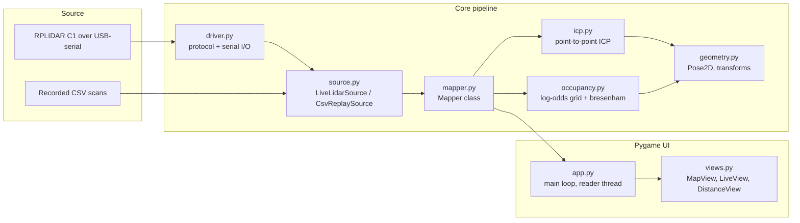
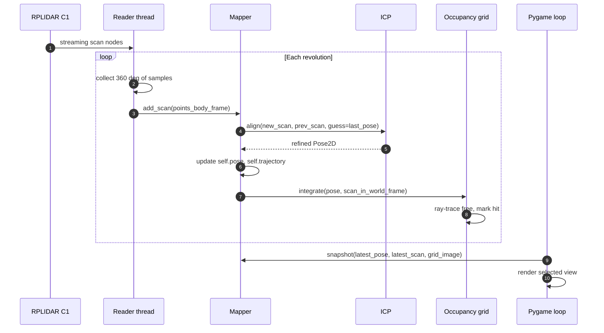

# House Mapper

A small, real-time 2D mapping tool for the SLAMTEC RPLIDAR C1. Walk
through your house with the LiDAR and a laptop, and a top-down
occupancy map fills in as you go. Three switchable views let you
focus on the map being built, the raw live scan, or a numeric
distance dashboard for measurements.

This is a sibling subproject to the `python/` track in the parent
repository: it shares the from-scratch driver style (no `pyrplidar`,
direct serial protocol per `docs/protocol-notes.md`), but is
organized as a proper Python package with separated concerns and
unit tests.

## Demo

<video src="https://github.com/Youngermaster/LiDAR-from-Scratch/raw/main/.github/assets/house-mapper-video.mov" controls width="720"></video>

> If the player does not appear above (most browsers other than Safari do
not play QuickTime `.mov` inline), [download or view the demo here](../.github/assets/house-mapper-video.mov).

## Scope

What this does:

- Continuously read scans from the LiDAR.
- Run point-to-point 2D ICP between consecutive scans to estimate
  the sensor's pose.
- Project each scan into a world frame and update a log-odds
  occupancy grid.
- Render three pygame views in real time: map, live scan, distances.
- Save a snapshot of the map (PNG) and the trajectory (CSV) on
  demand.

What this does **not** do:

- Loop closure. The pose drifts over time, especially in long
  corridors or rooms with repeated geometry. A 10-minute walk in
  a small house is realistic. A full-house tour will skew.
- Sensor fusion with an IMU or wheel odometry. There are none.
- 3D mapping. The C1 is a 2D sensor; the map is 2D.

If you need any of the above, this is the wrong tool; the right
tool is a real SLAM stack (`slam_toolbox`, `cartographer`, etc.)
in a ROS 2 workspace, not a from-scratch project.

## Architecture



The mapping pipeline per scan looks like this:



## Setup

```bash
cd house_mapper
python3.11 -m venv .venv && source .venv/bin/activate
pip install -r requirements.txt
```

On macOS with Apple Silicon, see the `docs/hardware-setup.md` in
the parent repo for the "Allow accessories to connect" permission
gotcha. Mapping cannot start if `detect_lidar_port.sh` does not
find a port.

## Run

```bash
# Live mapping, auto-detect port
python main.py

# Live mapping + record every sample to data/recordings/scan_<ts>.csv:
python main.py --record

# Explicit port and slower motor:
python main.py --port /dev/cu.usbserial-1130 --motor-pwm 600

# Replay a recording. Bare filenames resolve under data/recordings/.
python main.py --replay scan_20260522_180342.csv

# Or any absolute or cwd-relative path:
python main.py --replay /tmp/some_other.csv

# Show INFO logs (defaults to quiet):
python main.py --verbose
```

### Data convention

Two folders under `data/` hold the artifacts the tool reads and
writes. Both are git-tracked (each has a `.gitkeep`) but their
contents are gitignored at the repo root.

```
house_mapper/data/
  recordings/    Input CSV scans. `--replay <bare filename>` looks here.
  maps/          Output of pressing `S`: map_<ts>.png + trajectory_<ts>.csv.
```

The recordings schema is the same one used by
`python/experiments/08_save_scan_to_csv.py`, so a CSV produced in
either place can be replayed in either place. Drop a recording into
`data/recordings/`, then:

```bash
python main.py --replay my_apartment.csv
```

## Views and controls

Three views, switch with the number keys:

| Key | View              | What it shows                                              |
| --- | ----------------- | ---------------------------------------------------------- |
| 1   | Map view          | Occupancy grid being built, trajectory, current pose.      |
| 2   | Live scan view    | Just the current scan in the body frame, like RViz.        |
| 3   | Distance view     | Numeric distance in 12 angular sectors, plus min/max.      |

Common keys (any view):

| Key       | Action                                                   |
| --------- | -------------------------------------------------------- |
| +  /  =   | Zoom in                                                  |
| -         | Zoom out                                                 |
| SPACE     | Pause / resume map building (rendering keeps running)    |
| R         | Reset the map (does not stop the sensor)                 |
| S         | Save snapshot: PNG of the map + CSV of the trajectory    |
| ESC / Q   | Quit (motor stops cleanly on exit)                       |

## Files

```
house_mapper/
  README.md                   This file.
  requirements.txt            pyserial, numpy, scipy, pygame.
  pyproject.toml              Package metadata, pytest config.
  main.py                     Entry point: `python main.py [args]`.
  house_mapper/               The actual Python package.
    __init__.py
    geometry.py               Pose2D, polar/cartesian helpers.
    icp.py                    Point-to-point 2D ICP with kd-tree.
    occupancy.py              Log-odds occupancy grid + raytracing.
    driver.py                 RPLidarC1 serial driver (vendored).
    source.py                 LiveLidarSource, CsvReplaySource.
    mapper.py                 Mapper coordinator class.
    views.py                  MapView, LiveView, DistanceView.
    app.py                    Pygame app loop, view switching.
  tests/
    test_geometry.py
    test_icp.py
    test_occupancy.py
```

## Tests

```bash
pytest -q
```

The math modules have unit tests; the UI does not (it would need a
display and is best verified by running the app).

## Limits and known issues

- The C1 produces ~480 samples per revolution at 10 Hz. ICP runs at
  full rate on a modern Apple Silicon Mac. On older hardware you may
  want to subsample.
- If you spin in place on featureless flooring, ICP has nothing to
  match against and drift accumulates. Walk into rooms with walls.
- The map does not erase moving people. A person standing still for
  a few scans then walking away will leave a "ghost" until the
  log-odds bleed back to "free" via several clean ray-traces.
